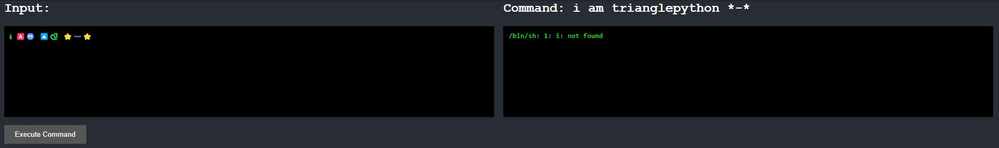
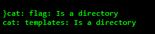
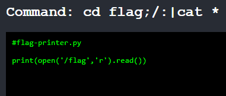
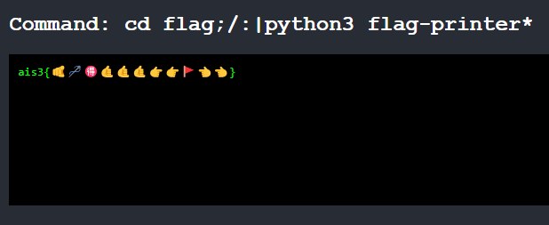

# Emoji Console
這是一個表情符號的 shell，從 placeholder 和回傳結果就可以看出來

1. 嘗試使用 `cat` 命令看目錄下面有什麼
```bash=
🐱 ⭐
```
可以看到結果有一個 emoji map table、 source code 和一行報錯



2. 嘗試 `cat` flag 資料夾裡面的東西，可以從剛剛 dump 出來的 json 找可以用的指令
```bash=
💿 🚩😓😑🐱 ⭐
```
這邊使用`;/`和`:|`切割指令，回傳的結果似乎是一個 python file


3. 執行python，get flag
```bash=
💿 🚩😓😑🐍❸ 🚩➖🖨️⭐
```
